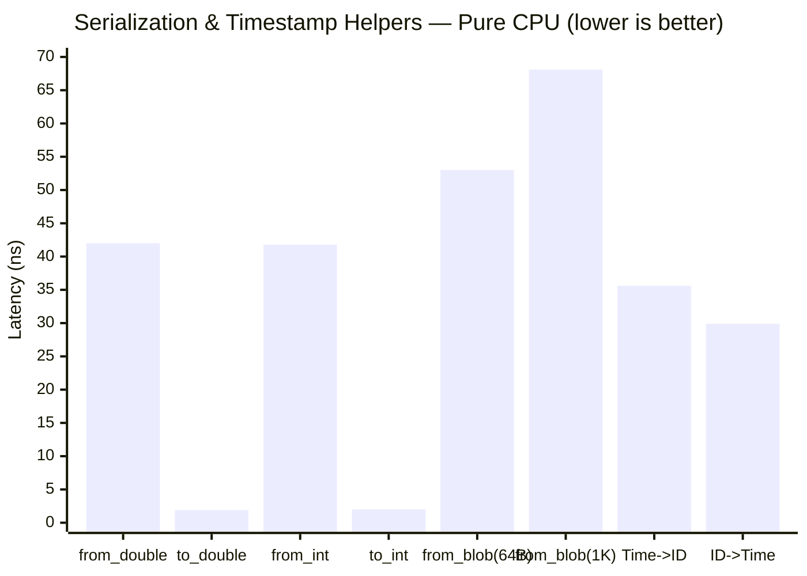
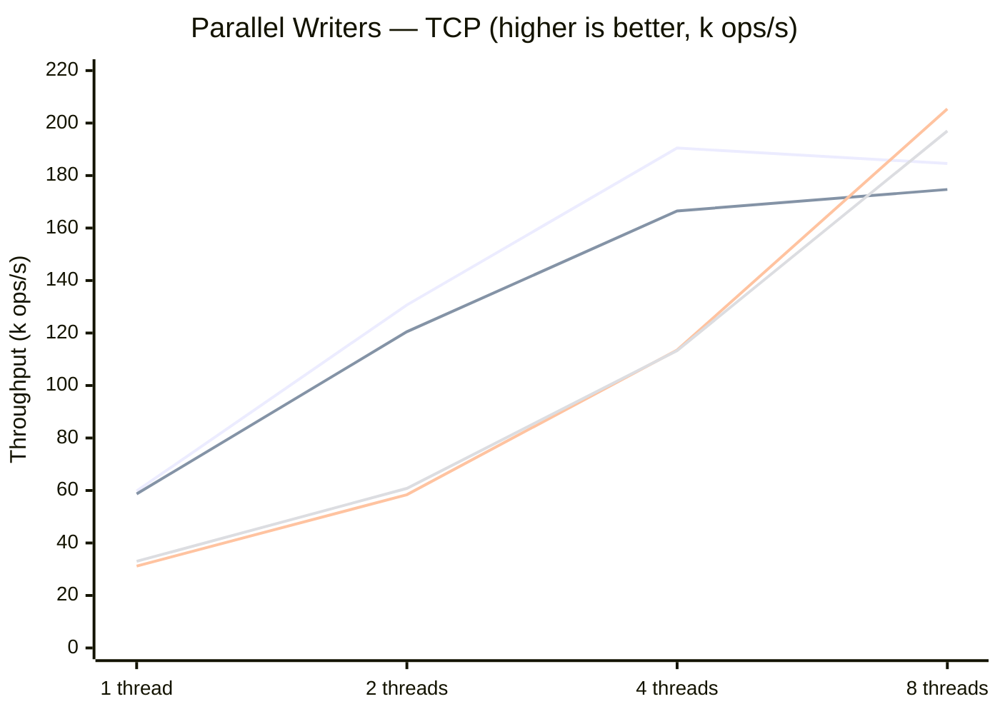
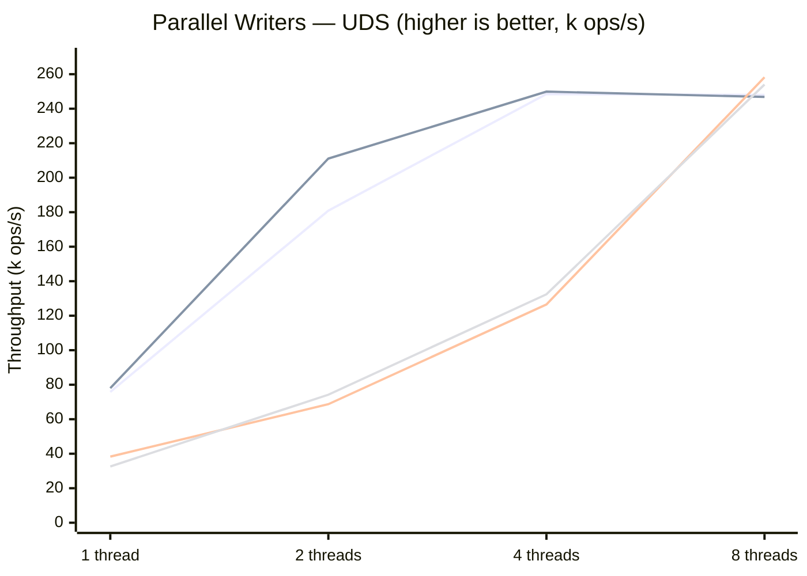
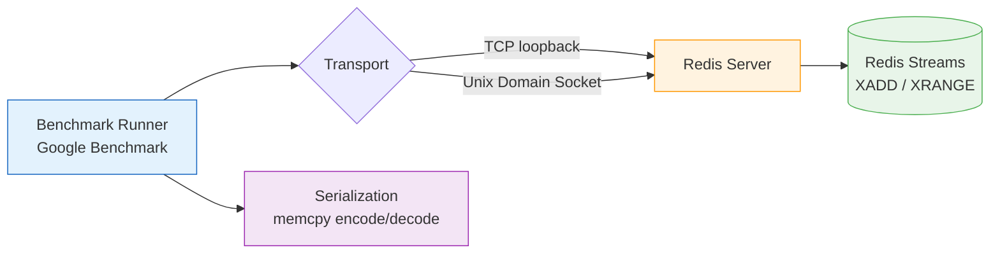

```mermaid
xychart-beta
    title "Bulk Add — TCP (higher is better, k items/s)"
    x-axis ["Batch 10", "Batch 100", "Batch 1000"]
    y-axis "Throughput (k items/s)" 0 --> 170
    bar "7.0.15" [155.6, 133.3, 110.6]
    bar "7.4.8" [144.6, 134.6, 148.1]
    bar "8.0.2" [104.0, 130.3, 106.2]
    bar "8.6.1" [99.5, 97.5, 118.1]
```

```mermaid
xychart-beta
    title "Bulk Add — UDS (higher is better, k items/s)"
    x-axis ["Batch 10", "Batch 100", "Batch 1000"]
    y-axis "Throughput (k items/s)" 0 --> 230
    bar "7.0.15" [176.1, 176.1, 188.1]
    bar "7.4.8" [224.8, 140.1, 128.2]
    bar "8.0.2" [127.5, 125.7, 163.7]
    bar "8.6.1" [110.4, 135.7, 144.4]
```

# RedisAdapterLite Benchmark Report

> **System:** 20-core x86_64, 2.4-4.0 GHz, L3 8 MiB x2
> **Build:** Release (`-O2`), Google Benchmark v1.9.1
> **Transports:** TCP loopback, Unix domain socket
> **Persistence:** Disabled (`save ""`, `appendonly no`)
>
> | Color | Version |
> |-------|---------|
> | Blue | Redis 7.0.15 (system package) |
> | Purple | Redis 7.4.8 (built from source) |
> | Orange | Redis 8.0.2 (io-threads 4) |
> | Green | Redis 8.6.1 (io-threads 4) |

---

## Serialization Helpers

memcpy-based encode/decode performance. These are pure CPU — no Redis involved. Decoding (`to_double`, `to_int`) is ~2ns. Encoding allocates a `std::string` (~42ns).

---

## Single Operations — TCP

Latency for individual add/get operations over TCP loopback. Redis 7.0.15 is consistently ~2x faster than 8.x for single-threaded operations.

```mermaid
xychart-beta
    title "Single Operation Latency — TCP (lower is better, us)"
    x-axis ["addDouble", "addInt", "addStr16", "getDouble", "getInt", "getStr16", "PING"]
    y-axis "Latency (us)" 0 --> 40
    bar "7.0.15" [17.5, 16.1, 15.0, 16.6, 15.9, 13.6, 14.4]
    bar "7.4.8" [16.5, 17.8, 15.5, 17.1, 17.3, 17.8, 15.3]
    bar "8.0.2" [29.2, 31.4, 30.7, 34.8, 29.9, 31.8, 26.2]
    bar "8.6.1" [28.3, 30.3, 32.6, 34.0, 34.2, 28.8, 27.5]
```

| Operation | 7.0.15 | 7.4.8 | 8.0.2 | 8.6.1 |
|-----------|--------|-------|-------|-------|
| addDouble | 17.5 us | 16.5 us | 29.2 us | 28.3 us |
| addInt | 16.1 us | 17.8 us | 31.4 us | 30.3 us |
| addString/16 | 15.0 us | 15.5 us | 30.7 us | 32.6 us |
| getDouble | 16.6 us | 17.1 us | 34.8 us | 34.0 us |
| getInt | 15.9 us | 17.3 us | 29.9 us | 34.2 us |
| getString/16 | 13.6 us | 17.8 us | 31.8 us | 28.8 us |
| PING | 14.4 us | 15.3 us | 26.2 us | 27.5 us |

---

## Single Operations — UDS

Same operations over Unix domain socket. UDS reduces latency by 5-8us vs TCP on 7.0.15.

```mermaid
xychart-beta
    title "Single Operation Latency — UDS (lower is better, us)"
    x-axis ["addDouble", "addInt", "addStr16", "getDouble", "getInt", "getStr16", "PING"]
    y-axis "Latency (us)" 0 --> 35
    bar "7.0.15" [11.6, 11.3, 9.7, 14.3, 11.2, 10.0, 10.7]
    bar "7.4.8" [12.9, 11.3, 10.8, 13.7, 14.3, 16.6, 7.9]
    bar "8.0.2" [26.2, 28.5, 28.2, 30.6, 29.6, 26.5, 25.9]
    bar "8.6.1" [25.3, 26.7, 27.5, 31.3, 27.2, 28.8, 25.8]
```

| Operation | 7.0.15 | 7.4.8 | 8.0.2 | 8.6.1 |
|-----------|--------|-------|-------|-------|
| addDouble | 11.6 us | 12.9 us | 26.2 us | 25.3 us |
| addInt | 11.3 us | 11.3 us | 28.5 us | 26.7 us |
| addString/16 | 9.7 us | 10.8 us | 28.2 us | 27.5 us |
| getDouble | 14.3 us | 13.7 us | 30.6 us | 31.3 us |
| getInt | 11.2 us | 14.3 us | 29.6 us | 27.2 us |
| getString/16 | 10.0 us | 16.6 us | 26.5 us | 28.8 us |
| PING | 10.7 us | 7.9 us | 25.9 us | 25.8 us |

---

## TCP vs UDS — Redis 7.0.15

Direct transport comparison on the fastest Redis version. UDS wins by 1.3-1.9x on every operation.

```mermaid
xychart-beta
    title "TCP vs UDS — Redis 7.0.15 (lower is better, us)"
    x-axis ["addDouble", "getDouble", "PING", "Add+Get"]
    y-axis "Latency (us)" 0 --> 35
    bar "TCP" [17.5, 16.6, 14.4, 30.7]
    bar "UDS" [11.6, 14.3, 10.7, 28.1]
```

| Operation | TCP | UDS | Speedup |
|-----------|-----|-----|---------|
| addDouble | 17.5 us | 11.6 us | 1.5x |
| getDouble | 16.6 us | 14.3 us | 1.2x |
| PING | 14.4 us | 10.7 us | 1.3x |
| Add+Get Cycle | 30.7 us | 28.1 us | 1.1x |

---

## Parallel Writer Scaling

Aggregate throughput with N concurrent writer threads. Redis 7.0.15+UDS peaks at ~250k ops/s. Redis 8.x io-threads help at 8 threads but don't overcome the single-op latency penalty.

### TCP

### UDS

| Writers | 7.0 TCP | 7.0 UDS | 8.0 TCP | 8.0 UDS |
|---------|---------|---------|---------|---------|
| 1 | 59.8k | 75.8k | 31.2k | 38.3k |
| 2 | 130.7k | 180.9k | 58.4k | 68.7k |
| 4 | 190.5k | 248.5k | 113.5k | 126.5k |
| 8 | 184.6k | 248.0k | 205.4k | 258.2k |

---

## Bulk Add Throughput

Individual XADD calls in a loop. UDS advantage compounds linearly with batch size.

### TCP

### UDS

---

## Architecture Overview

---

## Key Takeaways

1. **Redis 7.0.15 is the fastest** for single-threaded and low-thread workloads — ~2x faster per-operation than 8.x
2. **UDS is 1.3-1.9x faster than TCP** on the same Redis version (saves 5-8us per round-trip)
3. **Best config: Redis 7.0.15 + UDS** — peaks at ~100k single-thread ops/s and ~250k aggregate ops/s
4. **Redis 8.x io-threads help at high concurrency** (8+ threads) but don't overcome the per-operation latency regression
5. **Serialization is free** — memcpy helpers are 2-42ns vs 10-18us round-trip
6. **Transport advantage disappears for large batches** — at 1000+ entry reads, server-side work dominates
7. **All versions converge at ~1.2 GiB/s** for 1 MiB blob writes (memory copy limit)

---

*Generated from Google Benchmark JSON data. Raw data in `doc/benchmarks/*.json`.*
